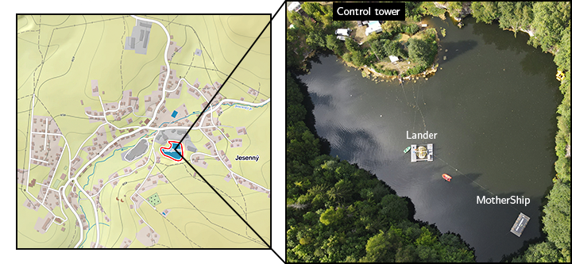
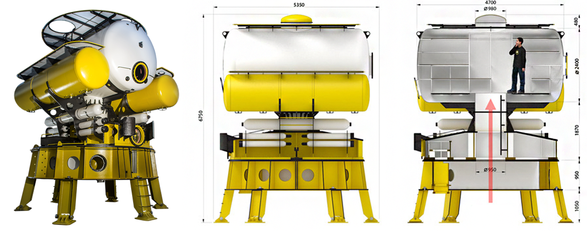
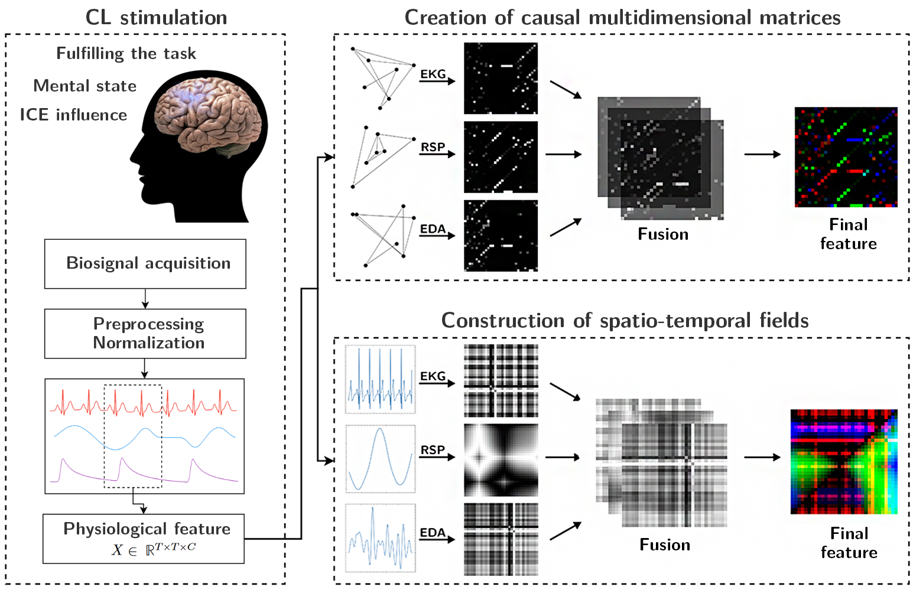
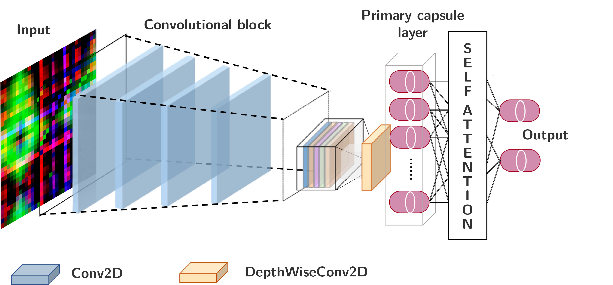

# *Assessment of cognitive load in extreme environment*

This is my master's thesis that I wrote during my final year of studying the
biomedical engineering program at the Faculty of Biomedical Engineering, CTU in
Prague. The work was made possible thanks to the [Hydronaut project](https://hydronaut.eu) under the
auspices of the European Space Agency (ESA). Unfortunately, the whole work is written
in the Czech language. I may translate it into English in the future.

### [Click here to read the thesis.](https://dspace.cvut.cz/handle/10467/112590)

## Abstract
The thesis focuses on the assessment of cognitive load in extreme environments,
which is critical for the success and safety of individuals and teams performing
demanding and essential tasks. Traditional monitoring methods using
questionnaires or behavioral analysis may be impractical or even impossible in
extreme conditions. For this reason, there is a growing interest in using
peripheral biosignals for real-time cognitive load assessment. Specifically, the
thesis examines the impact of extreme environments, such as an analog space
mission, on the manifestations of cognitive load in electrical cardiac,
respiratory, and electrodermal activity. To assess the cognitive load, a new
multimodal approach is introduced based on the creation of physiological
features in the form of multivariate spatiotemporal causal patterns, allowing
for a unique encoding of specific cognitive states. A capsular neural network is
designed for synergic uniform integration of the physiological features to
capture spatiotemporal causal relations by exploiting autoencoder compression
capability. The proposed solution is tested on popular publicly available
benchmark datasets, including data from an analog space mission.

## Experimental part of the work
This thesis benefits from the second space analogue mission (mission DIANA),
which simulated a lunar landing and was carried out as part of the Hydronaut
project in the summer of 2022. The individual compartments of the mission had
the following roles: the control tower was the station on Earth, the MotherShip
orbited the lunar orbit, and the landing module (Lander) was on the surface of
the Moon. The individual compartments can be seen in the Figure 1.

<figure>
<figcaption>
<b>Figure 1 - Detail, location and individual mission compartments (map source: Mapy.cz)</b>
</figcaption>
</figure>

A six-member crew was selected for the DIANA mission. Three individuals on the floating platform (MotherShip) and another three for the underwater station (Lander). Given that the underwater habitat involved a long-term saturation dive, the Lander crew was made up of professionally trained divers. The mission primarily served to examine the influence of personality characteristics and external factors on team dynamics during a long-term stay in an ICE environment. The whole experimental part is described in detail in the thesis itself.

<figure>
<figcaption>
<b>Figure 2 - H03 DeepLab and its schematic (source: Hydronaut Project a.s.)</b>
</figcaption>
</figure>

## Novel method for cognitive load assessment using multivariate spatiotemporal causal patterns
A multimodal approach to assess cognitive load using peripheral biosignals,
specifically using electrical cardiac, respiratory and electrodermal activity,
was developed as part of the thesis work. The Copula-Granger approach with Lasso
(ℓ1) regularization was chosen to capture time-causal relationships in the used
biosignals, which combines the concept of Granger causality with the theory of
copulas. However, it cannot be assumed that this captures all of the complex
dynamics present in biosignals. This problem is compensated for by using Gramian
Angular Fields. These patterns capture a certain kind of temporal and spatial
correlation within physiological signals.

<figure>
<figcaption>
<b>Figure 3 - Scheme of physiological features creation</b>
</figcaption>
</figure>

For the purposes of classification tasks (cognitive load assessment), a capsular neural network architecture based on the solution presented by [Mazzia et al. (2021)](https://www.nature.com/articles/s41598-021-93977-0), Efficient-CapsNet, was proposed. To synergistically unify the generated physiological features, autoencoder compression into a single latent space is used to capture spatiotemporal causal relations across biosignals.

<figure>
<figcaption>
<b>Figure 4 - Schematic of the proposed capsular neural network model based on the <a href="https://github.com/EscVM/Efficient-CapsNet">Efficient-CapsNet</a> architecture. Each convolutional layer in the proposed solution is additionally followed by BatchNormalization, MaxPool2D and Dropout layers. (scheme adapted from <a href="https://pubmed.ncbi.nlm.nih.gov/34901796/">Wang et al. (2021)</a>)</b>
</figcaption>
</figure>

## Results
The proposed solution (cognitive load recognition and classification) in this work was compared to selected existing approaches that utilize machine learning for cognitive load assessment. The comparison can be seen in the table below.

| Author | Dataset | Window | Test accuracy | Year |
| :--- | :---: | :---: | :---: | :---: |
| [Feradov et al.](https://ieeexplore.ieee.org/document/9244287) | CLAS | 30s | 84% | 2020 |
| [Ahmad et al.](https://arxiv.org/abs/2107.04566) | WESAD | 1s | 72% | 2021 |
| [Garg et al.](https://dl.acm.org/doi/10.1145/3397482.3450732) | WESAD | 10s | 84% | 2021 |
| [Rabbani et al.](https://www.mdpi.com/2306-5354/9/8/374) | WESAD | 10s | 87% | 2022 |
| [Zhu et al.](https://ieeexplore.ieee.org/document/9856558) | CLAS | 30s | 86% | 2022 |
| [Quadrini et al.](https://link.springer.com/chapter/10.1007/978-3-031-18840-4_13) | WESAD | 60s | 91% | 2022 |
| [Chatterjee et al.](https://link.springer.com/article/10.1007/s11334-022-00470-6) | WESAD | 30s | 94% | 2022 |
| [Dair et al.](https://link.springer.com/chapter/10.1007/978-3-031-26438-2_1) | WESAD | 10s | 69% | 2023 |
| [Rashid et al.](https://ieeexplore.ieee.org/document/10097874) | WESAD | 30s | 93% | 2023 |
| [Galarraga et al.](https://link.springer.com/article/10.1007/s00521-022-07435-7) | WESAD | 20s | 90% | 2023 |
| [Henry et al.](https://www.techrxiv.org/articles/preprint/On_the_robustness_of_machine_learning_models_for_stress_and_anxiety_recognition_from_heart_activity_signals/21688352/2) | WESAD | 6s | 81% | 2023 |
| [Yong et al.](https://link.springer.com/chapter/10.1007/978-3-031-26422-1_20) | CLAS | 5s | 75% | 2023 |
| [Singh et al.](https://onlinelibrary.wiley.com/doi/10.1111/exsy.13239) | WESAD | 5s | 91% | 2023 |
| **Author of the work** | **WESAD** | **5s** | **97%** | **2023** |
| **Author of the work** | **CLAS** | **5s** | **92%** | **2023** |
| **Author of the work** | **WESAD** | **1s** | **95%** | **2023** |
| **Author of the work** | **WESAD** | **1s** | **92%** | **2023** |

## Acknowledgements
I would like to thank the supervisor of my master thesis, Mgr. Ksenia Sedová,
Ph.D. for help, advice, and professional management of this work. I would also
like to thank Ing. et Ing. Jan Hejda, Ph.D., for all-around help, a lot of
valuable and inspiring advice, suggestions adn recommendations. Last but not
least, I thank my family and all the friends who supported me in creating this
work.

### Contributors
* Marek Sokol - *Author*
* Mgr. Ksenia Sedova, Ph.D. - *Supervisor*
* Ing. et Ing. Jan Hejda, Ph.D. - *Consultant*
